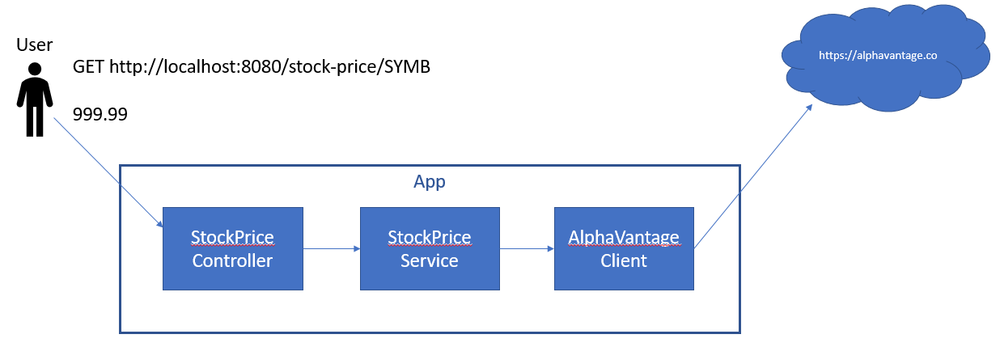

This first version of the service is structured as shown below:

To run this version you will need an api key for AlphaVantage.

You can get a license key here: https://www.alphavantage.co/support/#api-key

And set it in the ALPHAVANTAGE_API_KEY environment variable when launching the app.