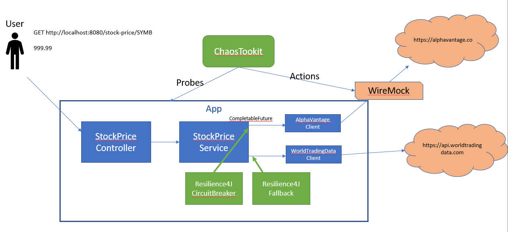

In this version, the app is unchanged, but we've introduced a [WireMock](http://wiremock.org/) between the app and the remote service.



Start the app, and then start the wiremock by running this command from the 'wiremock' directory

```
./run_wire_mock.sh
```

With the wire mock in place we can now simulate failures of the service and see how our app behaves.

```
GET http://localhost:8080/stock-price/JBHT
```

Should return a stock price.

But if we stop the WireMock, we simulate a scenario where the remote service is down. What happens when we invoke the service again?

A few observations about this version:
* We can now simulate failures by stopping the WireMock.
* We can use WireMock json API to introduce more advanced failures cases like delays and specific faults.
* Testing using WireMock is done manually in this version.
* The application does not handle faults in the remote service.

# Continue
Continue to [03_ChaosToolkit](../../tree/03_ChaosToolkit)