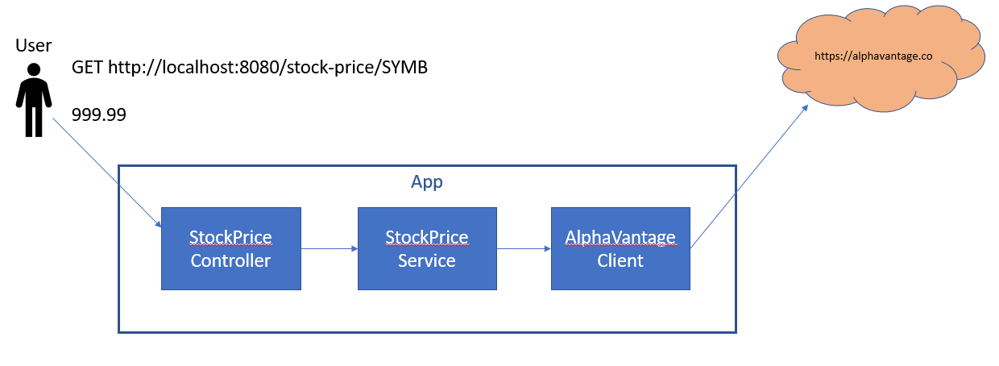

First, we start with a very basic application. The structure is shown below.



Run this app and then use your favorite client to:

```
GET http://localhost:8080/stock-price/JBHT
```

You should receive a stock price.

A few observations about this version:
* There is no way to simulate failures without reconfiguring the applicaiton.
* Once the app has been reconfigured it has to be restarted to recover. Automatic recovery from failures can't be tested in this version.


Continue to [02_WireMock](../../tree/02_WireMock)