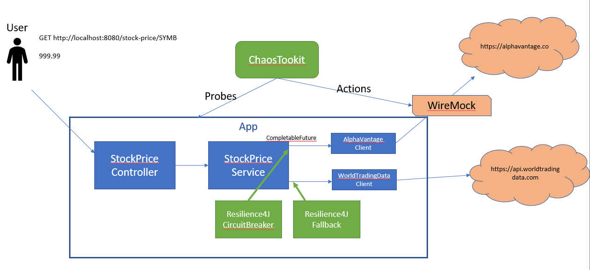

 This version builds upon the WireMock example and introduces [ChaosToolkit](https://chaostoolkit.org/) with the [WireMock driver](https://docs.chaostoolkit.org/drivers/wiremock/) .




To run this version you will need an api key for AlphaVantage.

You can get a license key here: https://www.alphavantage.co/support/#api-key

And set it in the ALPHAVANTAGE_API_KEY environment variable when launching the app.

With this version, all calls to alphavantage go through a wiremock.


To run this version you will need an api key for WorldTradingData.

You can get a license key here: https://www.worldtradingdata.com/

And set it in the WORLDTRADINGDATA_API_KEY environment variable when launching the app.


Start the app, and then start the wiremock using this command from the 'wiremock' directory

```
./run_wire_mock.sh
```

With the wire mock in place we can now simulate failures of the service and see how our app behaves.

With ChaosTookit we can run experiments and simulate failures:

```
chaos run chaostoolkit/experiment-success.json
chaos run chaostoolkit/experiment-fault.json
chaos run chaostoolkit/experiment-delay.json
```

With the new configuration, the fallback takes over on failures and we can pass the fault testing. However, delays are still a problem.